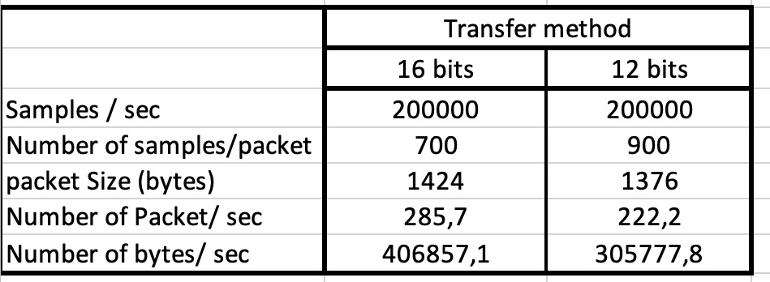

Just a proof of concept  to push 200K samples/sec of analog signal conversion from Pico via UDP protocol.

The Pico code is written in C-SDK

The adcReader is written in GCC

The pico will broadcast a ping style packet so the adcReader will figure out what the Pico IP is.
Once it receives the Ping the adcReader will send a start command. The start command will start the adc data streams.
Also with the start command the Pico will know the IP to send the data.

Upon overrun the Pico will stop and start the ping broadcast again.

Core1 takes care of the ADC DMA and push the value into a circular fifo block which is pratically all the ram 
Core0 reads the fifo block and transfers it to the UDP socket. 

*** new update USB SERIAL ** dec 28
USB serial communication added. 
16 bits to 12 bits conversion and then encoded in base64 (including 6 bytes time_us_64() stamp) 
On Pi5 you need to use the base64 since the PI5 on USB serial is slower.
On Pi4 no problem.
To decode the signal you need to decode base64 first. the first 6 bytes are the timeStamp. the next are 12bits sample.
 3 bytes convert to 2 samples of 12 bytes.

*** update ***
The adc transfer now use 12bits instead of 16 bits since the highest nibble was always 0.
This help be reducing the number of bytes to be send. This way the packet size is smaller and  reduce the bandwith ~25%.

The adcReader is the receiver application. It will output to the stdout! 

To store the udp stream which contains ADC values you just need to pipe the output to a file. 

ex: 
&nbsp;&nbsp;&nbsp; <b>./adcReader >advalue.dat</b> 
 
or use this method to split in 2GB files. 
&nbsp;&nbsp;&nbsp; <b>./adcReader | spit -b 2G - advalue.dat_</b> 

The adcReader presently starts the pico process and acknowledge each data transfer. 
It also uses the same fifoBlock.c from picoADC_UDP.
After 5 seconds of not receiving data it will exit.
Except for the adc values all the print are directed to stderr.

<b>It is working </b>  
Right now I was able to transfer 200K samples/sec. To to that I pratically used the full memory like buffer to be able to resend
unreceived packet.  a buffer of 140 blocks of 700  16 bits ADC values  roughly ~200K bytes.

Be aware that the wifi needs not to be used by other devices too much.

At home with all my IOT devices, mostly MQTT (~20 units), The pico was able to handle  the 200K transfer.
like the next table will show sometimes It got near the top. 
Very often the block transfer is ack right away but sometimes it piles up because of unreceived packet or is not received in order. 

 
first number, current fifo block (-1 means  fifo empty) 
second numner, the total number of blocks need to be transfer. 
<blockquote>blockReady : 119 /2
blockReady : -1 /0  
blockReady : 128 /1 
blockReady : 90 /10 
blockReady : -1 /0 
blockReady : 25 /20 
blockReady : 18 /19 
blockReady : 37 /1 
blockReady : -1 /0 
blockReady : 0 /9 
blockReady : -1 /0 
blockReady : 52 /106   <= this is heavy pile up (max is 140) 
blockReady : 30 /1 
blockReady : 132 /7 
blockReady : -1 /0 
blockReady : 128 /2 
blockReady : 12 /1 
blockReady : 22 /8 
blockReady : 108 /11 
blockReady : 89 /5 </blockquote>

 

<b>To compile the Pico code,</b>
<blockquote>
mkdir build 
cd build 
cmake -DPICO_BOARD=pico_w -DWIFI_SSID="Your WIFI ESSID" -DWIFI_PASSWORD="Your WIFI password" .. 
make 
</blockquote>

 
<b>To compile adcReader,</b>
<blockquote>
gcc -pthread adcReader.c fifoBlock.c -lpthread -o adcReader
</blockquote>
 
<b>Version 1.3  Dec 21</b> 

- Option in control packet to reset on overrun. 
- Add revision number 1.3. 
- Add Makefile on root to compile adcReader with different fifo buffer size. 
- Put 64bit timestamp on block.  
- Add the number of packet missed count. 
- Clean  usb serial output display. I use minicom /dev/ttyACM0 on the Pi. 

<b>to do,</b> (more like a wish list) 
- add argument to include timestamp into output. 
- add argument to save to a file instead of stdout. 
- add argument to set sample rate and set 2 or 1 channels 
